After four years of my studies at Srishti, and with less than two months left for my graduation, the time obviously comes for every undergraduate student to answer a very critical question:

What do you plan on doing after college? 

For some, this may be getting that bag and sitting on a pile of gold.

For some, this may be climbing the corporate ladder of a prestigious company. 

For some, this may be giving up on the subject of their undergraduate degree altogether.

All these paths, to me, are equally valid. There is nothing wrong with any of these directions.

The past 5 years have only instilled in me a deep sense of dissatisfaction, and an even deeper sense of curiosity. Many years of talking, doing, making, both succeeding and failing, both teaching and learning, from the many people I've met along the journey as well as my own nature as a person, have led me to the conclusion that there are many questions in this world that I need answered.

As I see it, there are two gaps to be bridged. 

**One**, the gap between what the world needs and what we are capable of doing to address those needs, and **Two**, my desires as a person and my capacity to act on and fulfill those desires.

Obviously, the nature of what I intend to accomplish with my career as a project may span many, many years, with no end in sight. It may require a tenacity, work ethic, resilience and perseverance that I may not possess. Yet, a whisper still rings in my heart, that what I believe -nay, what I have faith in- must be accomplished, even if it is imperfect. I may succeed or fail, but it has to be outlined, demarcated, expressed, even in its roughest impure form.

So, what are my larger goals? What exactly are the grand ambitions of this clueless, broke armchair-philosopher 23 year old? I've written this to clarify what my field and intentions are, so as to dispel any confusion. This is going to be a VERY long read that can be dry at times, so please note before you proceed.

# New needs, New developments

What we call design methodology in its current form precedes a lot of important historical developments. Don Norman's *Design of everyday things* was published in 1985 and was originally called the *Psychology of everyday things.* Tim brown's *Design thinking* method that he formulated in the very early 2000's is what most of us recognize as the standard design thinking process. While to many these methods remain sufficient,we are missing certain critical nuances. 

#### **The increasing power, affordability and ubiquity of chips and sensors**

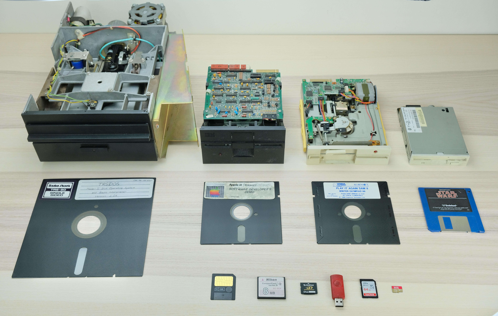

The above image showcases the development of storage devices over 45 years. What we can directly infer from this evolution is that personal storage is getting smaller, more dense and more mobile. The factors that have driven this growth is something called "Moore's law", which states that *that the number of transistors in an integrated circuit (IC) doubles about every two years*. What this results in, is something futurist Ray Kurzweil called the "Law Of Accelerating Returns".

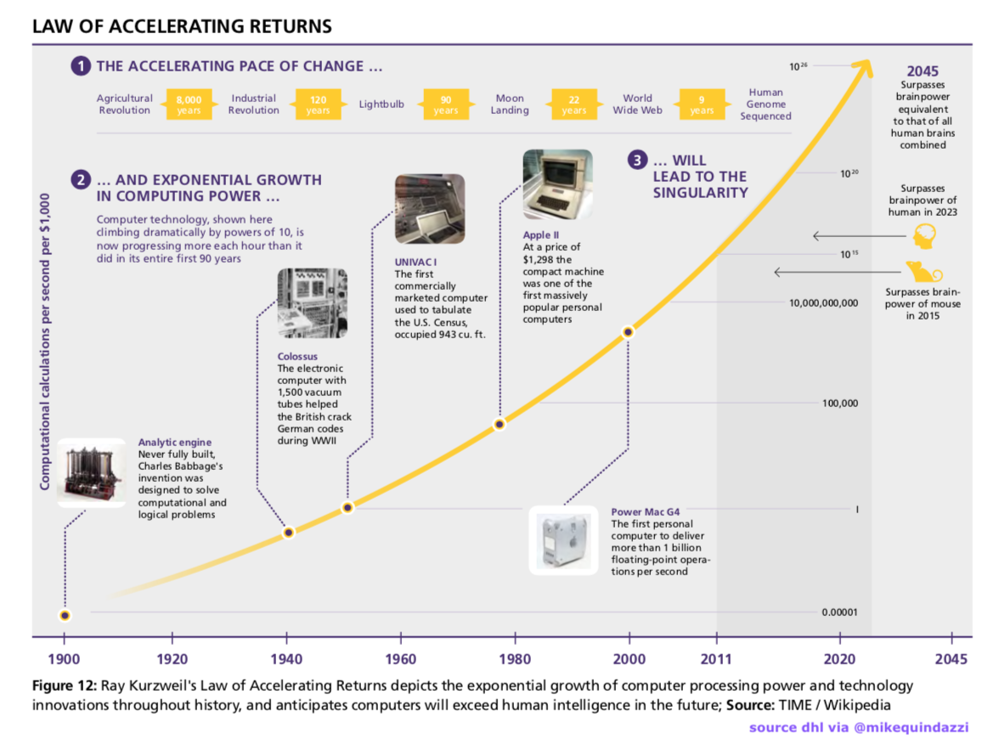

The law basically states that far from being a straightforward line of improvement, accelerating returns means that every year, the improvement effectively doubles. What we're seeing happening overall is imperceptible yet significant. Computer chips and sensors are getting smaller, cheaper, smarter, more common and ever more powerful with each passing year. 

This is why it's also hard to pinpoint the potential of new paradigms as and when they arrive. In 2023, sensors are the gears that drives the industrial complex overall, and the amount of data they capture is enormous. We now have affordable sensors for nearly everything, from biosignals to weather instrumentation. And these capabilities only grow further.

#### **The nature, potential and evolution of personal computing systems**

A critical fact to consider is that computers are no longer the devices they were back then, 40 years ago. As computers evolve, they move along multiple significant lines of change:

* Increasing imperceptibility (computing becomes harder to actively notice i.e invisible )
* Increasing Ubiquity (computing eats into more places that didn't require computing prior)
* Decreasing latency (computers process more things faster)
* Increasing intelligence (computers are getting "smarter" at responding to humans)
* Increasing affordance (computers are capable of doing more and more things)
* Increasing integration (computers are becoming more tightly coupled with their users)
* Increasing ability to simulate (Computers have the ability to mimic the dynamics of any system)

Computers are probably going to move in this historical trajectory

Industrial ( Early days of US millitary research) ->

\->  Personal (Apple Macintosh)  ->

\-> Mobile (Iphone) -> 

\-> Wearable (smartwatches) ->

\-> Spatial (XR headsets) ->

 Ambient-Imperceptible, a Doomer Matrix-like scenario where its all [computronium](https://en.wikipedia.org/wiki/Computronium) and computers manage everything outside our perception (well, [not exactly](https://tangible.media.mit.edu/project/radical-atoms/))

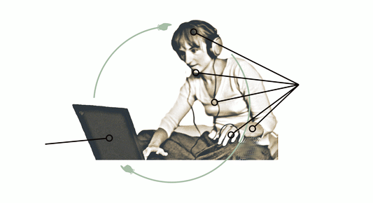

\
These trends build the now commonplace principle of "biofeedback", where human responses are dynamically managed and coordinated with or by computational systems. This can be used for good (apple watches saving people dying of heart attacks) or bad (Reel addiction via Product designer Nir Eyal's *[Hook-cycle](https://www.nirandfar.com/how-to-manufacture-desire/)).* The computer now becomes a cybernetic extension of people's sensory systems, making the Mcluhan quote turn from metaphor into literal reality. 

What we are actively seeing happen is the transformation of computers from inert static machines (like wheels and steam engines) to something more akin to a *living organism*. Even the ability of computer programs to accommodate plugins, mods, skins and add-ons looks less like pencil sharpener and more like a living creature performing  *endosymbiosis,* the ability to ***evolve using external entities.*** MIT Media Lab alumni and Computational designer John Maeda explicitly states as much in his book " How to speak Machine", declaring that in a very primitive way, machines are effectively complex adaptive systems with much more in common with living creatures.

The problem then becomes clearer that current design models are derivative of the mother disciplines of industrial and graphic design, both themselves representative of a top down approach that is great at dealing with inert objects but struggles with the complexity of living creatures. The implication is that after a certain threshold is reached, the [reductionist enlightenment era physical model](https://patterns.architexturez.net/doc/az-cf-172819) that we have used for design will have to eventually give way due to being insufficient.

It's safe to say that current design methodology is good enough, but doesn't really make complete use of what computers *really* are and what they eventually will become.  As a wise (disgraced) man once said:

“ *Design has also evolved from the design of objects, both physical and material, to the design of systems, to the design of complex adaptive systems. This evolution is shifting the role of designers; they are no longer the central planners, but participants within the systems in which they work. This is a fundamental shift- one that requires a new set of values”*

*\-Joi Ito, former MIT media lab director*

#### **The emergence and evolution of the Internet (Metcalfe's law)**

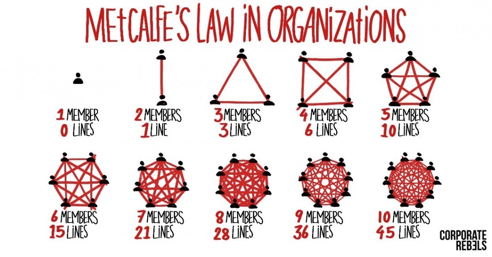

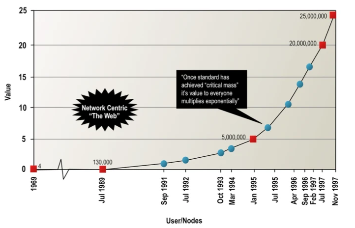

The internet really started taking off in 1998, and when it arrived, no one at the time really knew what it really could become. Now, the internet literally drives the entire planet forward, with internet culture evolving from being a small part of the mainstream to both becoming as well as **defining**  the mainstream. And now with the [spatial web](https://medium.com/swlh/an-introduction-to-the-spatial-web-bb8127f9ac45) (  a combination of XR and IOT being connected as one giant system ), we see that the network dynamics of the internet will probably explode beyond what we know of it as of today. 

Yet despite the emergent properties of network effects defining design problems of today ( Facebook's engagement system eventually becoming a reason for driving political polarisation) , we still see little to no discussion of networks and their qualities. The idea of emergence, despite its overreaching and far felt effects today, is practically ignored in mainstream design discourse. All current design models were developed before the complete emergence of the internet's "critical mass" and its ability to connect people globally. 

#### **Big Data and Big business (Late-stage capitalist realism):**

"Big Data" refers to large data sets that are too large and too wide to encompass, and thus require specialized techniques to parse through effectively. And in our current day and age populated by invisible surveillance systems that generate entire pools of information, big data drives big business. Almost every business on eart relies on some form of analytics to survive, and the biggest companies use their data collection system as competitive leverage. The power and pull of big data is so great, "data driven design" is starting to become a motif within industry trends. Large datasets have the ability to predict changes that regular people are incapable of, which is why many companies have shifted to a purely quantitative approach of analyzing customers.

Now we may say that design is a great defense mechanism against the scary clutches of big business's watchful eye, but the truth is that empathetic research may not necessarily bear fruit as an empathetic solution. The pull of Business and capital are starting to morph design away from its origins, with UX turning into product design, industry stalwarts like Jakob Nielson telling designers to "do away with inclusivity" and "to think in dollar signs" as well as the establishment of nefarious practices such as ***dark patterns.***

Fighting against data is pointless, and designers will be on a losing streak if we continuously rub shoudlers against the power (and dangers) of data. In fact when we look at the evolution of design as a practice, we can notice three major trends:

1. Design outcomes become more "abstract"
2. Design increasingly divorces itself  from its craft-based Bauhausian roots
3. Design approaches problems of increasing scale
4. The outcomes stay in "place" for longer and its field of influence grows
5. Design itself, like computing, becomes more "invisible" and automatic

For example:

 (Industrial, Graphic design) ->( User Experience Design ) -> (Service/System/Strategic design) -> ??

Capitalism's influence on design outcomes will always stay, and businesses do not care for things like empathy and improving people's lives. As design itself moves from the scale of communal to international and even planetary scope, the use of data to determine large-scale behaviour will soon prove necessary whether we like it or not. At the same time, we need to be mindful of capitalism's increasing chokehold on design, and how design itself, if not managed and guided properly, can exacerbate the devastating effects of late stage capitalism's descent into self-destruction (inevitably taking us along with it). 

The eye of capitalism becomes ever more determining of reality, and if we look close enough, American capitalism, through the large scale societal outcomes manufactured by dark design patterns,  is turning culture itself into one giant[ Casino machine](https://www.honest-broker.com/p/the-state-of-the-culture-2024).

#### **Generative AI and Synthetic Media**

A strange kind of hubris is developing in the design community, one which repeatedly maintains the following:

" AI is just a tool, it cannot replace us, the design process will largely remain the same"

Let's look at what AI is capable of doing:

* *Go*, an ancient Chinese game thought to be so complex it was a human only task. [AlphaGo by Google beat Grandmaster sedol in 2016, by using moves never played before in 1000 years history of the game](https://en.wikipedia.org/wiki/AlphaGo)
* *Bridge*, a card game that requires strategy of reading human facial expressions as opposed to the rough computation of chess and Go. Even Bill gates didn't think this was possible, but in 2022 [an AI model beat 8 of the world's best bridge players in a roundtable match](https://www.google.com/url?sa=t&source=web&rct=j&opi=89978449&url=https://www.theguardian.com/technology/2022/mar/29/artificial-intelligence-beats-eight-world-champions-at-bridge&ved=2ahUKEwiMr4TY0qOFAxWecGwGHabKDNsQFnoECB4QAQ&usg=AOvVaw1Y5rGsJCaeeMJA9pgUW0gv)
* [DeepMind solved the protein unfolding problem](https://www.technologyreview.com/2020/11/30/1012712/deepmind-protein-folding-ai-solved-biology-science-drugs-disease/), a task that stumped human biotechnologists for the past 50 years. DeepMind is also discovering [new nanomaterial configurations ](https://www.google.com/url?sa=t&source=web&rct=j&opi=89978449&url=https://phys.org/news/2023-11-google-deepmind-compounds-open-access-database.html&ved=2ahUKEwihnsWp0qOFAxWnXGwGHQT5DCEQFnoECA4QAQ&usg=AOvVaw0H3mDpo9xuhhd8mARrso0Y)that humans could not.
* AI is capable of translating complex languages like Chinese in real-time. For the record, Chinese is difficult not just because of the 1000 characters, but also due to the contextual intonation, cultural specifics etc involved. It's the hardest Language out there by a long shot and it's a breeze to AI.
* AI can [translate and map Whale calls](https://www.google.com/url?sa=t&source=web&rct=j&opi=89978449&url=https://www.wired.com/story/use-ai-talk-to-whales-save-life-on-earth/&ved=2ahUKEwjK_qzF0qOFAxV0xTgGHQmCAaMQFnoECCQQAQ&usg=AOvVaw0GcHAU3qrjO5bZUHbLlGfH)

In his 2019 SXSW ( a leading design conference) talk, designer Stephen Anderson outlines the following slide:

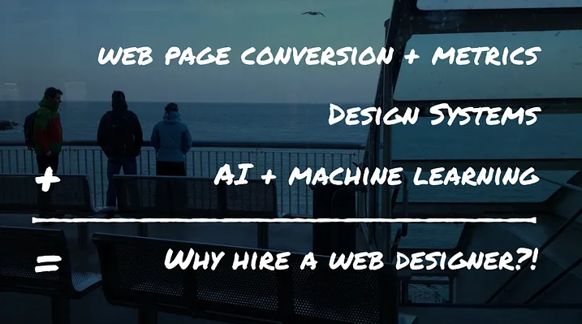

The slide is interesting because in the wake of generative AI, the above equation does ring doubly true. Put realtime data analytics, an already existing design system such as Material design and the newfound powers of LLM's and Machine learning, and what you can see happening is that businesses will soon be able to automatically generate designs, much like how figma and midjourney are capable of synthetically generating graphic design. 

Synthetic media is fast, it's powerful, it has access to numbers you as a person don't, can perform many more iterations at a faster rate than you do and even if it isn't perfect, it's good enough for businesses to ship. This last sentence is more key because culture , due to Moore's law, is accelerating at previously little understood paces, and now any business that works with the power of the internet and computers has much much more to gain than the Bauhasian perfectionism of early design culture.

Take for example the current headset war between Apple and Meta. Apple spent years on the Vision pro, as early as 2016, and in the end, to much hype and glory, announced the arrival of "spatial computing". Meta on the other hand, ran into the ground headfirst with its hugely mocked "metaverse" and the little spoken of Quest 3. 

Yet Meta's approach, which decided to go open source and imperfect as long as it hit the ground running, now came up with ***[the actual better product for its price](https://www.hindustantimes.com/technology/quest-is-better-than-vision-pro-why-zuckerberg-rates-meta-vr-above-apples-101707914233437.html).*** [Many have now returned their "overpriced" Vision Pros'](https://www.google.com/url?sa=t&source=web&rct=j&opi=89978449&url=https://www.theverge.com/2024/2/14/24072792/apple-vision-pro-early-adopters-returns&ved=2ahUKEwi9mvb60KOFAxVBa2wGHUIrDlEQFnoECCAQAQ&usg=AOvVaw2_-AYW93zIs4FLq9UeVvxP), and I believe Apple knew it, which is why they manufactured very few units of the same. Apple has understood , to some degree, that it's closed source perfectionist approach is starting to lose in business and leaving them in the dust, which is probably why it released its [Ferret LLM AI model as open-source on github.](https://www.google.com/url?sa=t&source=web&rct=j&opi=89978449&url=https://www.techopedia.com/apple-unveils-ferret-an-open-source-genai-for-vision-language-tasks&ved=2ahUKEwjXtOSd0aOFAxXfbmwGHQxjCx0QFnoECDAQAQ&usg=AOvVaw1CmaAFdS4QxMLNgwXzeKr2)

In the age of rapid change, first and "good enough" shatters the perfectionism of design hubris, which is why designers are going to be in for a huge shock if they think companies will be open minded to month long research cycles and relatively small scale prototyping phases. AI is a threat, and design, despite the showboating, is clearly clueless as a discipline on how to effectively utilize it.

The dangers of synthetic media, however, are even more grim. For the first time in history, people's faces and voices can be separated from their body, and evidence can be cooked from straight up from nothing. Synthetic exacerbates the growing problem of a [post-truth society](https://en.wikipedia.org/wiki/Post-truth), where deception prevails, and truth imperceptible. However, tackling synthetic media in and of its own is still not an often talked about topic, despite this specific issue being the utmost priority to tackle for proponents of design justice.

# A need for a novel syncretism

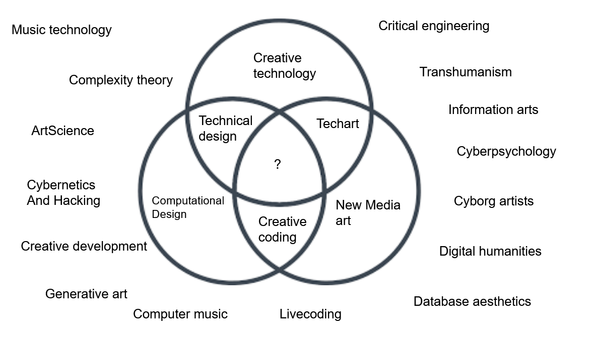

Syncretism is defined as:

So obviously I'm talking about building a new discipline in and of itself. But here's the deal. I don't think of myself as any guru or innovator or visionary, and I don't really need to be one in order to justify the need for a syncretism. The simple reason for a syncretism is that overall, I'm interested in a great many things, and yet its ***hard***  to put all of this in a box. Is it Computational design? Is it New Media? Is it creative tech? Music technology? 

My head really starts to hurt because ***all of these things are very closely related, yet none of them really have any overarching term.*** It's both all AND none of the above. So while I have said that this is the future of design (for my thesis), the truth is that this has nothing to do with design, technology, media, art, science, philosophy, and has everything to do with them as well. It's a fucking headache.

Sure we can try slapping on "media arts and sciences" but that still doesn't really fit or express what I am seeing in this diverse field of knowledge. All of the things in this map have it, but the entire field itself is not reducible to any single discipline. ***But whatever "it" is, it's here, it's important and I believe it's the future.***

The world is now increasingly complex, interconnected, changing. Both [Wicked problems](https://www.google.com/url?sa=t&source=web&rct=j&opi=89978449&url=https://www.stonybrook.edu/commcms/wicked-problem/about/What-is-a-wicked-problem&ved=2ahUKEwjl2JiE56OFAxV5umMGHf9rCpIQFnoECBYQAQ&usg=AOvVaw1lZTIv7dWmwNY1S2gDC30s) and [Wicked learning environments](https://www.driverlesscrocodile.com/books-and-recommendations/david-epstein-on-kind-and-wicked-learning-environments/) abound, and both are unforgiving. This is something design is trying to tackle, but due to its Bauhasian roots, its repeatedly failing to do so. What we need if we want to move further is:

* A perspective decolonized from [western WEIRD roots](https://www.nytimes.com/2020/09/12/books/review/the-weirdest-people-in-the-world-joseph-henrich.html). We need this because t[he extractive principles formed by the Baconian origins of science](https://hesiodscorner.wordpress.com/2018/07/11/francis-bacons-conquest-of-nature/) work well with chemistry and physics, [but not with the complexity of organisms and ecology](https://www.google.com/url?sa=t&source=web&rct=j&opi=89978449&url=https://www.youtube.com/watch%3Fv%3DKPUZiWMNe-g&ved=2ahUKEwjkhYal2KOFAxUXRmwGHU5pCv8QtwJ6BAgFEAI&usg=AOvVaw2bjWJ4akp9K0bympRDY11U), which technology will soon start to directly mimic. Top-down design is inherently colonial and inequitable because it still has the privileged designing for the under-privileged
* Wicked problems are interdependent, and the problems of climate change, capitalism, social alienation and political fracturing are all deeply interconnected phenomena, which we cannot solve with top-down processes. D
* New Media is starting to emerge faster than we can adapt to it. A new "Wu Wei" process is essential.

A Paradigm shift is probably the only way we can move forward on a collective level. I believe that although it may be impossible for me to enact that kind of change on a global level, the least I can do is enact that change on a personal level for my *personal* benefit.

The problem with current dialogue is that they are top-down i.e impositional. That's why you see design pundits hawk constantly that their ideas are still eternally relevant, despite the obvious fact that it soon won't. You have to work *with* your limitations, because the only true authority is reality. This top-down tendency is just  a part of being human and an individual in a larger social circumstance.

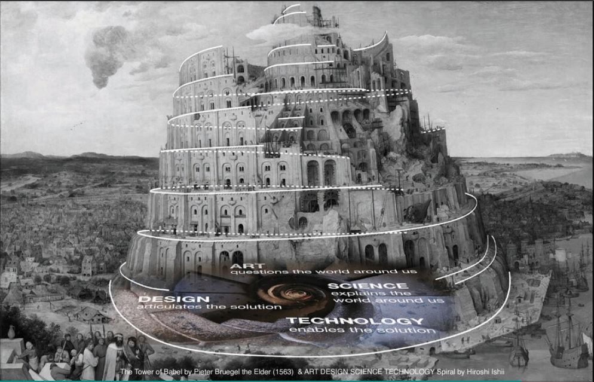

What I believe is required is something similar to what the Media lab outlined as "transcending" the tower of babel i.e being well versed in the four languages of art, science, engineering and design in order to transcend it and create something new. 

**Art: The grammar of transcendent sublime beauty that generates desire.**

To me, I don't believe in any nonsensical post-modernist ideas of art being either representation, bringing to surface, creation of concepts etc. That is a bourgiosie notion of art that deviously acts a class signifier separating rich people from the poor. If something needs you to read four books on Hegel, 3 essays from Foucault and a Spivak concept reader, its obvious that it's meant for some "enlightened" rich brat with too much time on their hands. 

It's also obvious how it acts as a means to separate the rich from the poor, as a poor person trapped in the capitalist machine forced to work 12 hours a day at the factory to send his kids to school and put food on the table will neither have the time nor education necessary to appreciate such "art". Let's call that kind of rubbish what it really is: ***jerking off the rich and privileged.*** (And no, I do not care for any justifications from snobby privileged elitists.) 

My idea of what art *is,* comes from the Indian sage Bharata and his treatise *the Natyashastra*. To Bharata, art is the *maya*, the illusion and simulation, the creation of the world of beauty, that realm which solely belongs to the title of those privileged enough to call themselves artists. The artist projects his magic, his immersive illusion of beauty, onto us until it envelops us completely. 

The sublime, that feeling of boundless awe , wonder and slight terror at the magnificence of a starry night sky, that's what art can do for the human race.  To Bharata, Art is a social responsibility that  the artist must carry out, the goal being the *enlightenment and* *transcendence of the viewer.* And unlike his contemporaries, Bharata believed that Art must be accessible to people from all walks of society (including the lower castes who were socially excluded in his time period). 

***To me, this "open-source" art is far more valuable to society's overall health***, than some sick money making tax fraud scheme. Artists create a sanctuary called beauty, providing rest and relief to all those who partake in its mesmerizing influence, and this is a means by which Art serves the social function of a soothing balm for a society in a mental health crisis.

Dostoevsky once said "Beauty will save the world". Why? Because while people fight to convince, argue and debate, the beautiful generates its own evident truth for all to follow. There's nothing that stirs desire in the human heart more than the sparkles of the beautiful.  That is something authentic, which cannot be *manufactured inauthentically.* 

The power of artistic beauty to rejuvenate the soul in a simulation of its own making is what gives it this incredible ability to ***create its own future.*** Desire is a powerful thing if we cage its need to consume the object of its desire, because then [it strives to create the object of desire itself.](https://www.theguardian.com/media-network/2015/aug/13/science-fiction-reality-predicts-future-technology) Consider that AI first appeared in sci-fi novels as a concept long before computers were even mainstream and before the field of machine learning itself, and we can begin to see how desire is a creative force if guided properly. 

Art generates desire via its ability to inspire imagination for new ways of being if we are enveloped in its creative potential. In New Media art, this is probably a potential latent in immersive media specifically. It's like Kafka's *Metamorphosis* or the anime *Serial experiments Lain*. The mysterious and surreal nature of those stories generated millions of interpretations while also being sublime, impactful and profound.

**Science: The grammar of evidence based conclusions**

Science is the first bottom-up discipline, and has been a hugely transformative influence on the way we live our lives. The reason why (most of us) believe in science lies in 3 aspects:

1. Direct inference via observations
2. Independently verifiable conclusions
3. Experimental repeatability

What science allows us, as a society, is to form our own conclusions about the world no matter what other people tell us. At times, these conclusions may break our heart, but it may prove necessary to further progress. 

For example, during the Copernican revolution, the church maintained that it knew of the universe through possessing the holy bible, and thus as the sanctioned representatives of god, directly authorized monarchy's right to rule. However, one of its deeply treasured "facts" was that of *geocentrism*  which in judeochristian custom said that the Earth was the centre of the universe. In contrast, the development of optics led to the telescope, which subsequently began the assault on the church and the cracks in feudalism. 

In a post-truth society where people are increasingly mediated by information entities and their virality, a form of "citizen science" that allows people to independently confirm the truth for themselves may be essential. These truths are often paradoxical, counter-intuitive and difficult to digest, but they remain true nonetheless. As someone who was raised christian, it was my birdwatching hobby and their manuals that allowed me to independently confirm evolution for myself, destroying any vestige of my faith forever.

Scientific modelling from complexity theory , such as the use of data science practices and mathetmatical models, may become indispensable when we inevitably deal with systems of scale. Media practitioners may sometimes have to act like scientists in assessing data, drawing conclusions from it and eventually building scientific models out of it.

Personally, the research and ideation phase of design is clearly inspired by the scientific paradigm  and has been all the better for it. The ability to draw new conclusions and overthrow previous models is why science continuously evolves with the times and is sensible, because the ability to infer from reality is a powerful bottom-up process, one which design sorely needs. To illustrate the problems of top-down impositional conclusions, here's [a list of absurd cures for the Bubonic plague as a result of Europe using the top-down conclusions passed down to them from the Greeks](https://www.worldhistory.org/article/1540/medieval-cures-for-the-black-death/), before the microscope determined the existence of bacteria and kickstarted the field of medicine.

Science is an attitude of observing and confirming reality as it that we must seek to cultivate through new media, if we are to have society solve its most difficult internal struggles. It's also a key to solving a larger crisis that I will expand upon later down this essay. I believe that I will benefit a lot from learning about the many intricacies of data-science and Complex systems modelling, especially since the later is oft applied to the study of biology and ecology.

**Engineering: The grammar of constructed affordances and abilities**

Engineering is just an extension of a core human capability: The ability to build tools. Tool-making is central to human nature, it's what we excel at as a species. Tool development and its usage is what makes a man.

Engineering is the construction of tools, abilities and affordances. A tool, like Mcluhan said, is like media: An extension of man. The wheel an extension of the legs, a telescope the extension of the eye. A tool represents the capture of certain forces of nature and re-directing them towards our own ends and means. For example, computer chips are just glorified rocks with inscribed sigils that "capture" electricity and direct it towards information processing. Thus, engineering a tool or instrument becomes constructing things that allow us to do *more.* 

The great myth of the genius inventor lies in the templatesque story propagated throughout the social sphere. A lone genius comes up with a grand idea, hacks away at something in his lab and then creates an innovation that he then sells for a massive profit. The truth is that most innovations come about as toys, accidents, fringe experiments or fixes to some annoying problem. 

For example, Penicillin, the famous antibiotic, was a consequence of Alexander Fleming forgetting to wash his bacterial culture dishes. The chariot was built in the steppes by the early central asian tribes to traverse it more effectively with their horses. It's very, very rare for truly disruptive innovation to develop from mainstream academic or industrial thought processes, and more likely for it to be something that is initially considered fringe, occult and esoteric ([reminder that Isaac Newton was a very weird person with no friends, spent very little time on physics and dedicated most of his life to predicting the return of Jesus christ and finding the recipe to the philosophers stone](https://en.wikipedia.org/wiki/Isaac_Newton%27s_occult_studies)).

 In fact, we find that the mainstream top-down approach and argument from authority is actually *bad* for innovation, and that fringe-tech in weird humble places works better. For example, neural networks were about to gain traction in the early days of AI, where it not for MIT AI lab head Marvin Minsky actual going out of his way to say that they were unusable and that his own "perceptron" method was better (Hint: it wasn't). What ended up happening was an AI funding winter where neural networks and AI as a field in general lagged behind for 20 years. 

As I've written in my Artscience post, inventions and tools that start out as crafts are initially not taken seriously, but much often later down the line acquire serious artistic, scientific and engineering merit. For example[, origami , the kidfriendly paper-folding craft is now starting to be applied to designing and building spacecraft.](https://medium.com/purdue-engineering/origami-in-space-shape-changing-is-a-game-changer-a17ef290a587) Tools may start out as fun past-times or gimmicks, but by extending the human senses and consequently the human mind, they possess the ability to generate new perceptions.

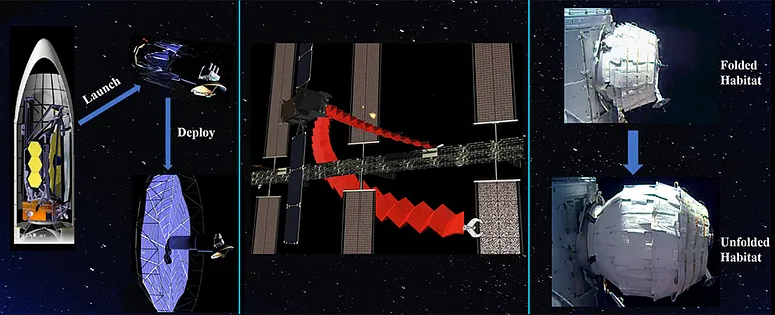

Bottom-up engineering is what we can call "hacking". The origin of the word "hack" did not mean to break into computer security systems, but [to create unique, funny  and novel inventions](https://www.catb.org/jargon/html/meaning-of-hack.html). Take for example the hacker mindset from the ["hacker how to " website](http://www.catb.org/~esr/faqs/hacker-howto.html):

Creative engineering doesn't come from an overlord giving instructions. Rather, we see that it's a process that comes from your own desire to play, experiment, tool, fabricate and reconstruct all the weird and wacky things that the world never knew it needed. This is something  hard to understand in a culture that consistently demands one be "practical" (an ever shifting transient definitions), but take the case of the first Iphone model.

When the first iphone released, it had:

* No app store 
* No mobile data (Jobs had to convince AT&T and Verizon to actually make this happen)
* It had no low processing power
* Even the touchscreen aspect was glitchy

For all intents and purposes, , it was product without a customer. But thing is, magical products, in the right time and place,  despite their gimmicky nature have this incredible capacity to *generate* their own use cases. It's this desire to experiment *with* their multifarious capacities and capabilities that builds an ecosystem around them. That's why invention, true creative innovation, can't happen within the mainstream. It has to be the "weird made cool". 

Every powerful innovation is in some shape or form an instrument. Whether they be a scientific instrument (microscope) or artistic one (guitar). There's also this weird tendency for objects that can do both to be exalted to this otherworldly status of sacred. Instruments, especially musical ones, are the objects that led me to question my design education, because it seems to me that we use design to limit the abilities of the instrument to satisfy human needs rather than get humans to bypass their limits and merge with the potential of the instrument itself. 

Symbiosis is important yet lacking: How do we tap into the real potential of an invention as it  presents itself? We can either raise ponies that allow humans to trot on the field in peace and quiet, or we can raise horses that allow humans to move past their human speed limit and create figures like Alexander the Great and Genghis Khan. If design refuses to lean *into* engineering, we're going to be stuck in a vapid culture that loves to bring out the mediocre in the great.

I think I need to learn how to hack stuff simply because ***that's what creative technology really is about***: generating new, creative ways of doing and being that we could not think of before. *The creative potential latent to technological instruments.*

**Design: The grammar of coupling and usability**

Now  while I have till now demonstrated poor regard for the work of Norman, Nielsen and Brown, I do appreciate that they, along with the talented people at Apple, have made a profound shift in what we think of design *as:* The change of the idea of making beautiful things to the ability to make things both beautiful *and* usable. That shift from the craft based origins of Bauhasian Industrial and Graphic design to the usability aspects birthed by their evolutes (Ergonomics and Branding) has done the field much more duty and has given it a degree of humanity that disciplines *lack* in general. 

Thus, while design emerged from artisanship, it is really not reducible to it as such and in many forms even opposed to it (just like how early science emerged in the sanctuaries of the catholic church yet soon became its end). Design is not art, art is not design. Design can artful, and art can be designed, but that's permeability, not sameness. When we think of something well designed, we think of something that's a bonafide joy to use, as opposed to something that we want to throw against a wall. Ease of use is now the dominant motive of design overall. 

While I disagree that a privileged person can ever really put themselves in the shoes of the underprivileged, that *empathy*  for pain points and the transmutation of pain points into an overall usable, efficient and pleasurable experience marks a paradigm shift, one that is extremely  beneficial to the field itself. Yet now, if we track this, I believe that this can only go in one more direction: The powerful, networked, stable and customized via *the Modular.*

Craft based design: *Beautiful artisanship* ->

\-> User Experience design: *Usable and ergonomic* ->

\-> **Modulative** design:  *systemic, stable, interdependent, custom tailored* 

We have failures of top-down empathy play out in GainesVille, when IDEO tried their Design Thinking method to create solutions for large scale communities. It didn't work, because of many interdependent systemic reasons outside of the designer's control. This failure carried the same hubris of design students who think they can solve the climate crisis through an app. What *participatory design* wants to achieve is to make the designer the "facilitator" of solutions for communities who then work with the designer to solve their problems.

The question is, how do we really build these solutions? Hence *modulative*  as opposed to modular (modulation is basically changing the properties of a system. For example, if you turn up the AC in your house, you are modulating the temperature)

Thus while the participants articulate the data and formulations, it's the designer that makes this formulation usable, systemically integrated and cohesive instead of tacky, ill bordered and ill fitted.

> “In order to design like nature, we need to consider how we can design a species. Thus, we will reframe the designer’s task from the design of a single physical object with a fixed form (the individual), to the design of abstract systems which encode the full range of formal possibilities for a particular design concept (the species).”
>
> \-Daniel Nagy, Generative designer

To be honest, this kind of design is so alien to me that I'm not sure of what existing product really look like, but here are some clues that I think can point us *towards*  a bottom up design. To start off with a quote from Christopher Alexander from *A pattern Language:*

> Christopher Alexander, “Systems generating systems”
>
> [1](https://coevolving.com/blogs/index.php/archive/systems-generating-systems-architectural-design-theory-by-christopher-alexander-1968/#one). There are two ideas hidden in the word system: the idea of a system as a whole and the idea of a generating system.
>
> [2](https://coevolving.com/blogs/index.php/archive/systems-generating-systems-architectural-design-theory-by-christopher-alexander-1968/#two). A system as a whole is not an object but a way of looking at an object. It focuses on some holistic property which can only be understood as a product of interaction among parts.
>
> [3](https://coevolving.com/blogs/index.php/archive/systems-generating-systems-architectural-design-theory-by-christopher-alexander-1968/#three). A generating system is not a view of a single thing. It is a kit of parts, with rules  about the way these parts may be combined.
>
> [4](https://coevolving.com/blogs/index.php/archive/systems-generating-systems-architectural-design-theory-by-christopher-alexander-1968/#four). Almost every ‘system as a whole’ is generated by a ‘generating system’. If we wish to make things which function as ‘wholes’ we shall have to invent generating systems to create them.  \[Alexander 2011, p. 59; Alexander 1968, p. 605]

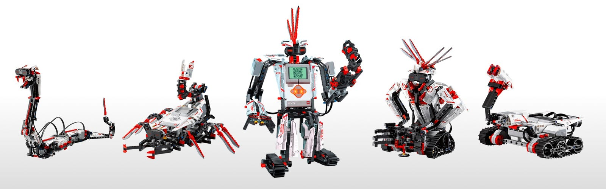

 we have already solved the problem of cohesiveness in a kit of parts, visually")

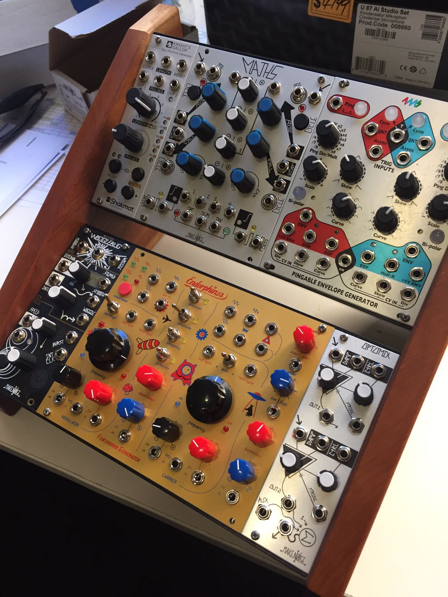

What I am probably trying to advocate for myself is, just like Barthes called for "death of the author" as a way to separate an author from their creative output (like how you separate JK Rowling from Harry Potter), I'm calling for **death of the designer** *where* the designer is actually separate from what the final outcome and potential of the design itself would be. In this manner, the designer's job would be twofold:

1. Building a powerful, creative and  generative system via crowdsourced data
2. Finding the best space within the immensity of those generated possibilities and reaching an optimal" zone" where those possibilities are various enough for choice yet not too many to paralyze  
3. Giving the participant the ability to choose their design solution.

Obviously, the reason that I used the example of a modular synth is because the selection process of those said possibilities will probably require *parameters* i.e Knobs and buttons determining how much of a certain trait you want in a solution. 

Thus, design becomes something that encourages people to move past their limits and ***make full use of the energy*** captured in a device, system or innovation, and not the perception management and mediocrity encouragement practice that we see it as today. 

In this manner, I think the future of design has to be some amalgamation of all of the above. An interesting aspect of why I think the above is necessary is because software and internet systems in general resemble a living organism undergoing change and updates rather than physical object. You can dynamically add features to and take away from a software like Adobe photoshop for example, which you cannot for say an Ipad.

So in a way, we have to give users the power to create their own worlds, while the task of usability and cohesiveness will become *invisible* i.e already done for them. This may not make a lot of sense in the context of phone apps, but in the context extended environments and immersive realities, trust me, this fact will become too obvious to ignore. 

This idea is a little too schizo and far fetched, and to be honest, I really don't know what it will look like. But when LLM's give people abilities they don't necessarily have to sink years into (such as coding and design)), and we have large scale systems, wicked problems as well as huge data sets, the role of the designer will obviously change, into one that make sure systems become *inter-dependent*. Like a living organism, each member does its own thing yet positively contributes to the functioning of the larger systems overall functioning.

This is where design moves from a topdown physical craft based model to a biological bottom-up generative *breeding* of solutions model. Yes, I know it sounds strange, but stay with me. 

Design then becomes the task of creating and living within a creative universe, and then subsequently guiding its evolution. What we have to do is to still make things usable, but we have to divorce ourselves from what the final design actually ends up looking it (when it stops being the object that designers want and starts being the object that users want) and what it is fully capable of (including how it interacts with things outside of it). This last part becomes more relevant especially when design's reach becomes spatial and we have to design for crowds of "users", including people from all walks of life both regular users and absolute newbies. 

The last aspect that hammers the nail in this biological design model is the newfound affordance of ***intelligence*** that LLM's and AI agents provide us. 

Design, eventually, becomes the design of an intelligent environment which the designer finds themselves embodied in, what the Anthropologist and Cybernetician Gregory Bateson called "[An ecology of Mind](https://www.architectural-review.com/essays/an-ecology-of-mind)". I really, REALLY like this term because its a direct step up from the affordance theory promoted by ethologist James Gibson, where we now move from  *systems thinking*  to ***systems intelligence*** much like how a collection of cells would coordinate behavior amongst  themselves. Environmental intelligence is a fascinating field. Check this article "[The intelligent forest](https://www.noemamag.com/the-intelligent-forest/)" by Noema Magazine to learn more.

.....................................................................................................................................................................

So to summarize a consolidated generative language:

**Art** -> Immersive, emotional and sublime beauty that generates novel imagination, sanctuary and transcendence

**Science** -> The discovery of  truths, mechanisms and forces *as they are*  and the construction of models simulating them, allowing for new developments to overthrow the old.

**Engineering** -> The capture of forces and their transmutation into playful affordances, abilities and even *senses*  that allow us to do a lot more than previously 

**Design** -> Making this potential usable, modular, customizable, *intelligent* and tailor fit to a wide variety of people, as well as *synergistic-ally coupled* with other dynamic systems, like the relationship between a bee and a flower. 

I don't know what this could really look like in contemporary terms, but UCSB's [Allosphere](https://www.youtube.com/watch?v=u-D-zEToJQ4) is a good example. It's immersive, sublime, musical, scientific, modular and pretty much fulfills all of the above. But maybe I need to start making stuff to actually fulfill this outline of what I think lies beyond.

These artifacts create new ideas, new abilities, new discoveries and new expressions in those that experience them , and can thus be called a generative artifact. This may seem like something new, but they've been here before, only to look like something that landed from outer space when they first released, like the printing press, the personal computer, the modular synthesizer, and most recently generative AI. That's what generative truly implies: ***the generation of novel possibility.*** 

# The Voice of the East

Partially, the reason why I want to do things differently is because of the way I've been taught design. My alma mater, Srishti, was still largely composed of traditional Bauhasian aspirations despite the experimental flavour that the media arts and sciences brought it. The school was largely coordinated and run by Ex-NID alumni, whose own tradition is as western as the west gets, being put into place there by the design duo Charles and Ray Eames.

But what that ultimately means is that there's no "[decolonized" Indian design](https://www.cca.edu/newsroom/decolonial-school-decolonizing-design/), because the very nuts and bolts of what we term design are very, by and large, undeniably western. And yet now there's a calling for new systems and ways of thinking. 

This has a lot of us flummoxed, because the model of design itself is inseparable from its western origins, and no matter how much surface paint we apply from our own cultures, we cannot really change the marrow of design itself being a western Bauhaus product. ***If we are to create a novel Indian media arts grammar, the entire project has to be conceptually theorized "bottom-up" as well.***

So I wanted to ask, does the East have a voice? I don't have a conclusive answer, but I still think, if we are brave enough, *maybe there can be.*

There are three aspects to this voice of the East that I want to cover:

* **Firstly , Sound may probably the next major perceptual microscope and shift in innovative thinking.**

Ever since the west has dominated global discourse for centuries, visual sense has dominated most, if not all sphere of life. We have begun to largely think of the world in terms of eyes and vision, and indeed it was the instruments of vision (microscopes, telescopes, the printing press) that have kick-started the scientific enlightenment era that is responsible for the modern age. T[his shift has now "reformed" sensory priority to one that is visually dominant according to media theorists Mcluhan and Ong.](https://blogs.ubc.ca/etec540sept09/2009/11/02/formal-response-2-the-evolution-of-culture-from-oral-to-visual-dominance/)

But in the worlds of science and data, we're beginning to shifts. Now, scientists are using sonic data to p[ropel conservation efforts](https://time.com/6279011/scientists-using-sound-to-study-nature/), as sound carries a breadth of scale that vision doesn't and this allows researches (via data sonification) to parse [big data in a way visuals cant](https://www.engineering.com/story/music-blends-with-engineering-as-big-data-is-transformed-into-sound). In the age of information, [sound may actually be the new optics](https://www.noemamag.com/the-sounds-of-invisible-worlds/).

* **India has a strangely futuristic sonic, spatial and computational philosophy.**

Eastern cultures work in circles and space, as opposed to the Western idea of lines and linearity. We can observe this most directly in terms of how religions in each hemisphere view the afterlife (heaven vs reincarnation as line from A to B versus Cyclic repetition), as well as creation stories. In Genesis (the first book of the bible), god first exclaims "let there be light", after which creation is molded by god's hand. In Hinduism however, creation bursts through the first *sound*, the ***shabda*** whose vibrations dynamically materialize the universe. This is one of the many instances where Indian thought takes the idea of *emergent spatiality* very seriously, most notably in the figure of the *yantra*  as a geometrical visual representation a sound based *mantra*.

Another example that comes to mind (I have a lot but it would massively extend this article), is the idea of *avatara.* This is a direct consequence of the Hindu belief in *Brahman* , a field of conscious, imperceptible space from whose matrix emerges individual forms with their unique attributes. 

This aspect becomes very interesting, after I quote this from the *Computational Design thinking* reader:

> "In his article Machinic Phylum, Manuel Delanda unfolds this philosophical concept and examines its significance in what he calls the *emergence of novelty*, where matter is seen as an active material with 'morphogenetic capabilities' to generate different structures through the constraints of its material properties........If you hold a carbon molecule in the right conditions it could take the shape of a diamond with its beautiful regular tetrahedal form. But it could also be graphite, who can rub off paper. ***One substance can occur in many forms"***

When we think of Generative design as the training of design models with data and creating emergent design from that via parameters, this strange yet analogical impression must be given a change. Generative design, in some way, fits Indian philosophy. How that came to be, I do not know, but it's here and it ***works.***

Sound runs through the core of Indian thought and practice. India has been a historically oral culture, with many artifacts of its literature passed down via spoken word and memorized in its entirety (This is why the veda's have been cryptic, because the actual meaning of what is being said can only be understood via certain aspects of how it is vocally expressed). The *Bhagavad Gita* , a holy book of Hinduism, translates very literally to "The Song of God". We see that sound is running thread throughout Indian thought, and this must be paid attention to. 

To be honest, Indian philosophy and computers are two things I never really thought would mesh well together, yet strangely enough, its very true that Indian philosophy works well with the intricacies of computation and Deep learning. The only thing left now is to really flesh out these maps and mold it. It also helps that the media arts and sciences have had a strong musical core if we're curious enough to look for it. For example, MIDI and OSC are two protocols that originally emerged from the music technology space, yet tonnes of media artists who aren't musicians themselves swear by it. 

Whatever "it" is, it's musical at its core.

* **Indian philosophy, somehow, in many ways fits complexity thinking better.**

This is also something strange, but bear with me. Two quotes, one from the "Computational Design Thinking" reader by Menges and Ahlquist and another from "Indian Philosophy Vol. 2" by S. Radhakrishnan

> "The holistic nature cannot be seen in the individual part, nor can it be seen in the addition of its parts. The system behavior only emerges in the dynamics of the interactions of its parts. This is not a cumulative linear effect but a cyclic causal effect in which the complexity of the level and amount of interaction **cannot be directly deciphered.**"
>
> \-pg 15, Computational design thinking Reader
>
> "The whole, the Nyaya philosophers maintain, is something different (arhantara) from its parts, even as a melody is something more than a sum of its notes..... The whole and the parts are related by way of inherence'
>
> \-pg 179, Indian Philosophy volume 2

The reason for this is probably due to the Idea that the universe is of cosmic intelligence. Brahman, the all pervading matrix from which substances *e*merge in their individual forms, is a *conscious* matter. This is a very sharp contrast to the mechanistic model of the universe as promoted [originally by the Greeks and later by Descartes](https://go.gale.com/ps/i.do?id=GALE%7CA89380915&sid=googleScholar&v=2.1&it=r&linkaccess=abs&issn=01479369&p=AONE&sw=w&userGroupName=anon%7Ecf90014b&aty=open-web-entry)

Emergence, systems intelligence, transience, chaos and complexity all work with Indian philosophy better. To map it out completely then, is a monumental task that can bear a huge variety of real fruit of labour.

# So what is *Akaasha-shaastra*?

*Akaasha-shastra* is a combination of two words. It is difficult to translate, and may sound huge pretentious (as well as borderline nationalistic), but I have genuinely coined this term because its a great way to neatly encompass what I want to do. 

First, *Akaasha.* The world itself is a reference to the element of "akaasha" (roughly 'ether') from the Nyaya school of atomic theory. Akaasha in modern times seems to be translated as space, but a better paraphrasing would be ether, negation or simply "information" (as I see it). Akasha, as defined in the Nyaya literature, is the medium that gives rise to "shabda" or sound, and is of celestial and cosmic nature. Akaasha is thus an undefinable space where the gods reside and magic weapons are formulated. 

Analogically, I'd like to think of it as the media of information . A computer can process an image of a triangle and display it on a screen, but if we unplug the screen, where's the triangle? There's no literal triangle, it's a sequence of beeps and bloops. Likewise, when people imagine a triangle, there's not literal triangle in their brain, it's just the manifestation of neural information pathways. In a larger context, I'd like to think of information as celestial media that precedes the creation of the universe itself. 

The word "celestial" and "cosmic" is such a great way to describe what I want to do, whether it be the space-like ambience of a modular synth, the immersive worlds of XR or the universes of data that manifest via the creative potential of deep learning[ latent space](https://theacademic.com/generative-models-and-their-latent-space/) in Generative Design, or may the infinite space of possibilities of new media itself, the cosmic and the celestial potential of the media arts practitioner is a a magical way to think about all of this. A universe doesn't need a religion or a set of values to appear magical, awe inspiring and sacred. It's us as humans in our imperfect nature, fueled by the ever consuming desire of consumerism that have turned away from what beauty *truly is. To me, the aim is to unlock the celestial and divine potential inherent in human nature.*

*Shaastra*  means "compendium", but I take my definition from Bharata yet again. In the *Natyashastra,* he advocates a unitary synthesis between all disciplines, especially art and science (similar to Wagner's *Gesamkunstwerk* or "total art"), yet Bharata takes a peculiarly modern stance by saying " treat this not as a manual, but a compendium. Take what you need, follow what works, and change the rules if the situation requires it. This is a huge contrast to modern founding texts, whose institutional influence actually prevents further progress by acting as a sort of holy book whose tenets must neither be questioned nor disobeyed. 

In many ways, *Shastra* is kind of like Deleuze and Guattari's Rhizome: An open system whose ingestion doesn't constrain by being a holy manual, but a way to generate ever more creative potentialities as a modular system whose modules you can actively include or ignore.

So if I had to translate, it would be " The Generative Art and Science of Celestial Sonorous media", but I guess that still wouldn't cover everything.

I hope It's still enough of a map to find my way out there in the real world.