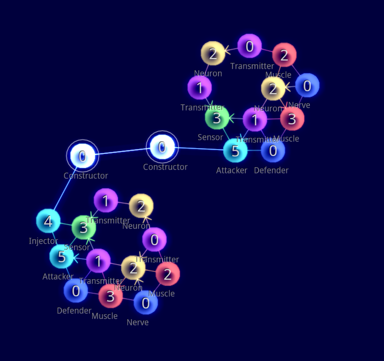

Artificial life is  the study of how life emerges in synthetic computational environments. Some of the most common examples of artificial life are conways game of life, Lindenmeyer systems and boids.

In the Artificial Life Environment project, one can design   tiny multicellular organisms which attack, reproduce and evolve. 

I've been fascinated by the potential of "living" art, or art that has an essence, something that artists from John cage to the expressionists have been talking about forever, although it is a staple of eastern thought, especially in chinese/zen painting and in Indian sculpture. ALIEN V4 gave me the perfect opportunity to see it through. However, it was pretty difficult for 3 reasons:

1. The jump from v3 to v4 was huge and as such no documentation for V4 existedd
2. V4 introduced Neural networks and new nervous system models for their organisms
3. I had no idea as to how system biology or synthetic life models were supposed to work

However, with time I was able to slowly overcome these difficulties in a couple of weeks, and create some truly beautiful organisms. Replication was my favourite part of the whole project, considering I could see new mutations emerge in each successive generation.